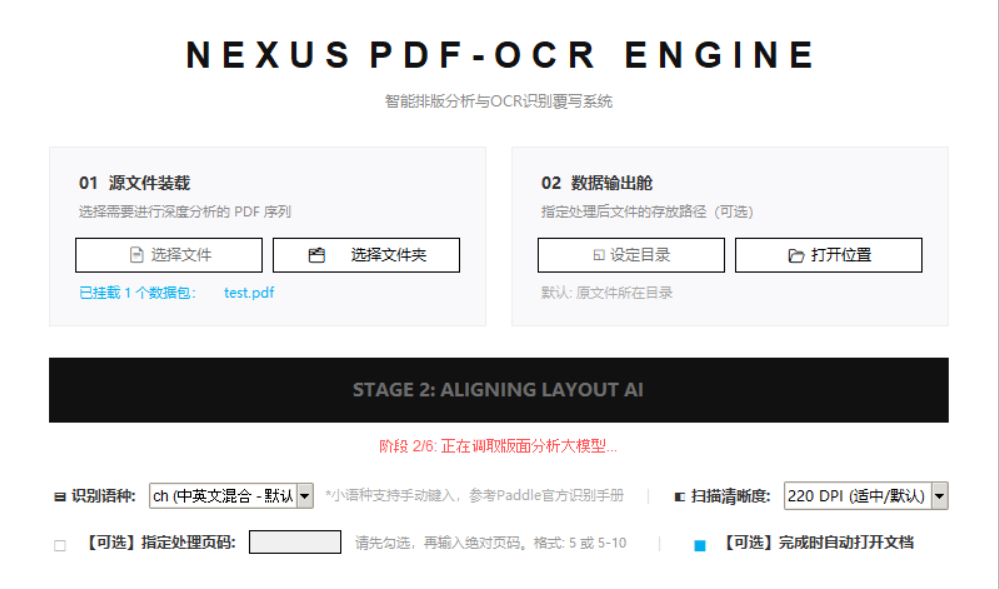
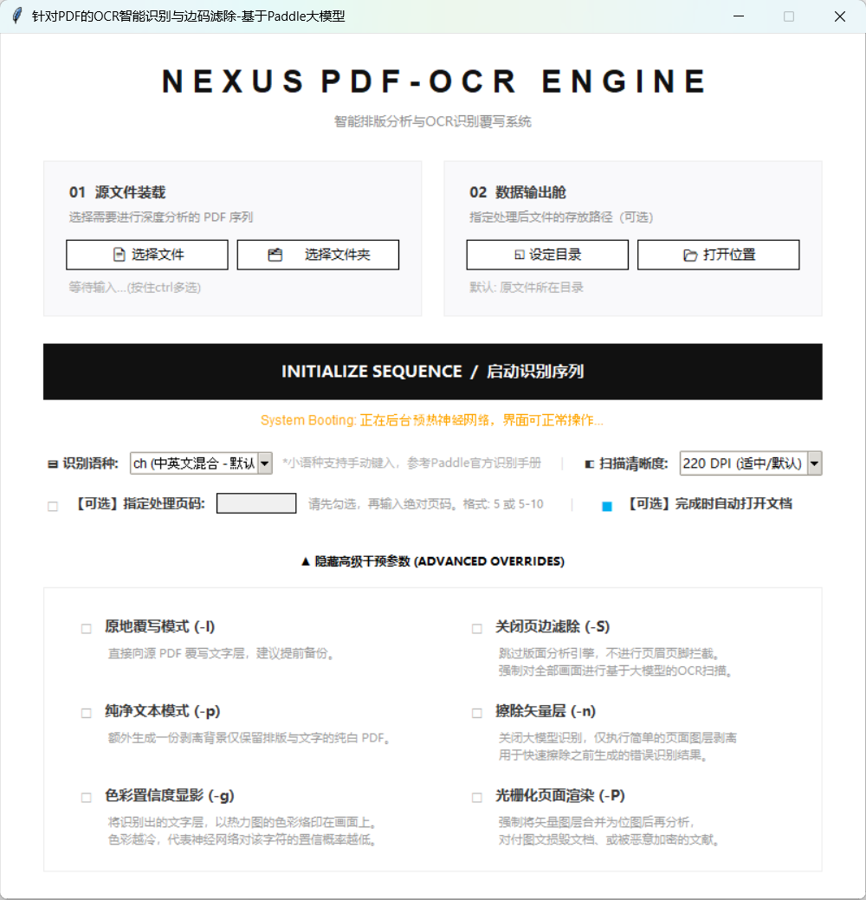
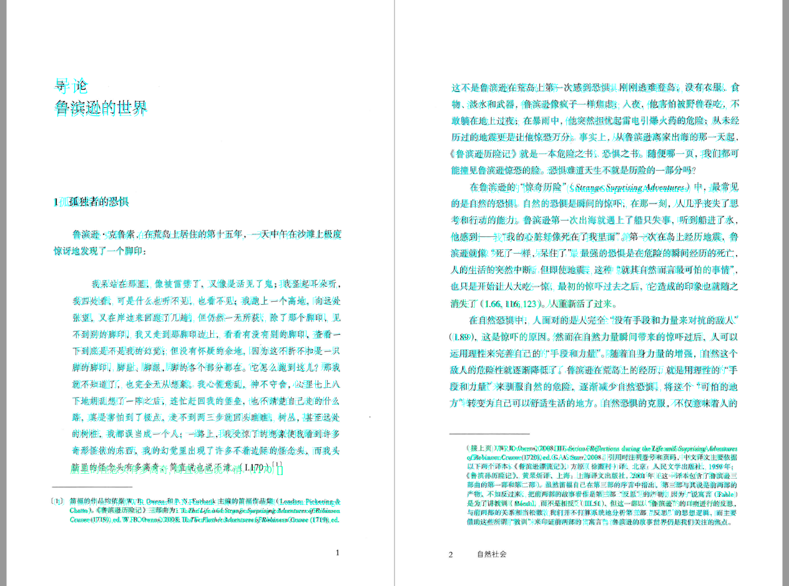

# PDFOCR PaddleV3

基于 PaddleOCR 3 与 PP-StructureV3 的 PDF OCR 桌面工具，为扫描版 PDF 添加可搜索、可复制的隐藏文字层，并通过版面分析减少页眉、页脚和页码对正文识别的干扰。

*A Windows-oriented GUI and CLI tool that adds a searchable OCR text layer to scanned PDFs, with layout-aware margin filtering.*

> [!IMPORTANT]
> 当前发布的是 **25-1 稳定源代码版本**，主要面向横排文档。程序目前固定使用 `gpu:0`，需要 NVIDIA GPU 及匹配的 PaddlePaddle GPU 环境；模型和 CUDA 不包含在仓库中。**竖排文字写入尚未解决，不应将本项目用于依赖精确竖排文字层的任务。**



## 项目特点

- **图形界面与命令行双模式**：不带参数启动时打开 Tkinter 桌面界面，带文件参数时进入 CLI 批处理。
- **扫描件文字层写入**：在保留原 PDF 视觉内容的基础上写入隐藏文字，使扫描件可以搜索和复制。
- **智能版面过滤**：通过 PP-StructureV3 抽样分析正文边界，过滤常见页眉、页脚和页码区域。
- **原生 PDF 检测**：抽样判断文档是否已有矢量文字层，并选择清理页边元素或跳过不必要的 OCR。
- **奇偶页分别拟合**：分别估计左右页的边界，适应书籍装订线和不对称页边距。
- **中文标点宽度调整**：压缩常见全角标点的文字层占位宽度，改善横排文字层与原图的贴合程度。
- **批量处理**：支持多文件、文件夹递归选择、指定输出目录以及同名文件自动编号。
- **局部处理**：图形界面支持指定单页或连续物理页码范围，如 `5` 或 `5-10`。
- **多档清晰度**：图形界面提供 150、220、300 和 400 DPI。
- **多语种识别**：界面内置中英文、繁体中文、日文、韩文、法文、德文等常用模型代码，也支持手动输入 PaddleOCR 语言代码。
- **资源清理**：处理完成后主动释放模型引用、图像缓存、内存和 GPU 缓存。

## 适用范围

本项目主要用于：

- 只有扫描图像、无法搜索文字的书籍或论文 PDF；
- 页眉、页脚和页码容易混入 OCR 正文的文档；
- 需要批量生成 `原文件名-OCR.pdf` 的本地工作流；
- 需要检查文字识别置信度或生成纯文本辅助 PDF 的实验场景。

它不是 PDF 编辑器，也不保证恢复原文档的字体、段落结构、书签、表格语义或阅读顺序。

## 已知限制

- **竖排文字未解决**：竖排文字、复杂旋转文字或特殊方向排版的隐藏文字层可能错位。
- **当前仅配置 GPU**：代码将 PaddleOCR 与 PP-StructureV3 的设备写为 `gpu:0`，没有 CPU 自动回退。
- **首次运行依赖网络**：未提供本地模型目录时，PaddleOCR 会尝试下载所需模型。
- **复杂版式存在误判可能**：大幅插图、跨栏排版、边注、异形页面或损坏 PDF 可能导致正文边缘被错误过滤。
- **高 DPI 占用更多资源**：400 DPI 会显著增加显存、内存和处理时间。
- **原地覆写具有风险**：使用 `-I` 或界面的“原地覆写模式”前必须备份源文件。
- 当前发布源代码与使用说明，不提供 EXE、CUDA、PaddlePaddle 安装包或预下载模型。

## 系统要求

推荐环境：

- Windows 10/11 64 位；
- Python 3.10；
- 支持 CUDA 的 NVIDIA GPU；
- 与显卡驱动和 CUDA 环境匹配的 `paddlepaddle-gpu`；
- 首次下载模型时可访问 PaddleOCR 模型源；
- 处理大型 PDF 时具备足够的显存、内存和磁盘空间。

本项目开发环境中已验证的主要版本如下：

| 组件 | 版本 |
| --- | --- |
| Python | 3.10.11 |
| paddlepaddle-gpu | 3.3.0 |
| paddleocr | 3.4.0 |
| PyMuPDF | 1.27.2.2 |
| opencv-contrib-python（由 PaddleOCR/PaddleX 安装） | 4.10.0.84 |
| Pillow | 12.1.1 |
| NumPy | 1.24.4 |
| tqdm | 4.67.3 |

其他版本可能可用，但尚未在本项目中验证。

## 安装

### 1. 获取源代码

可以在 GitHub 项目页选择 **Code → Download ZIP** 并解压，也可以使用 Git 克隆仓库。进入包含 `PDFOCR_PaddleV3.py` 的项目目录后继续下面的步骤。

### 2. 创建虚拟环境

```powershell
py -3.10 -m venv .venv
.\.venv\Scripts\Activate.ps1
python -m pip install --upgrade pip
```

如果 PowerShell 禁止运行激活脚本，也可以不激活环境，后续直接使用 `.\.venv\Scripts\python.exe`。

### 3. 安装 PaddlePaddle GPU

PaddlePaddle GPU 的安装命令取决于操作系统、显卡驱动和 CUDA 版本。请通过 [PaddlePaddle 官方安装页面](https://www.paddlepaddle.org.cn/install/quick) 选择与你的环境匹配的命令，不要盲目复制其他电脑的 GPU 安装命令。

本项目已验证过 `paddlepaddle-gpu==3.3.0`，但你仍需以官方安装选择器给出的索引地址和 CUDA 版本为准。

安装后检查 Paddle 是否识别 CUDA：

```powershell
python -c "import paddle; print(paddle.__version__); print(paddle.device.is_compiled_with_cuda())"
```

最后一项应输出 `True`。

### 4. 安装项目依赖

```powershell
python -m pip install -r requirements.txt
python -m pip check
```

PP-StructureV3 属于 PaddleOCR 的文档解析能力，因此依赖文件使用了 `paddleocr[doc-parser]`。可参考 [PaddleOCR 官方安装文档](https://www.paddleocr.ai/latest/version3.x/installation.html)。

PaddleOCR/PaddleX 会安装提供 cv2 的 opencv-contrib-python。不要再同时安装 opencv-python，以免两个包争用同一模块。

> [!NOTE]
> 代码导入的是 PyMuPDF 提供的 `fitz` 模块。请安装 `PyMuPDF`，不要安装 PyPI 上另一个无关的 `fitz` 包。

## 图形界面使用

启动程序：

```powershell
python PDFOCR_PaddleV3.py
```

如果 Windows 已正确关联 `.py` 文件，也可以双击脚本启动。

1. 点击“选择文件”载入一个或多个 PDF，或点击“选择文件夹”递归载入其中的 PDF。
2. 可选：设置统一输出目录；未设置时输出到原文件所在目录。
3. 选择识别语种和扫描清晰度。一般文档建议先使用默认的 220 DPI。
4. 可选：勾选指定处理页码并输入单页 `5` 或连续范围 `5-10`。
5. 检查高级选项；第一次使用建议保持默认。
6. 点击“启动识别序列”，等待六阶段状态提示完成。
7. 默认会自动打开处理完成的文档。



## 命令行使用

处理单个文件：

```powershell
python PDFOCR_PaddleV3.py "D:\PDF\input.pdf"
```

批量处理多个文件：

```powershell
python PDFOCR_PaddleV3.py "D:\PDF\book-a.pdf" "D:\PDF\book-b.pdf"
```

指定统一输出目录：

```powershell
python PDFOCR_PaddleV3.py "D:\PDF\book-a.pdf" "D:\PDF\book-b.pdf" -o "D:\PDF\OCR-results"
```

选择语言并生成置信度显影结果：

```powershell
python PDFOCR_PaddleV3.py "D:\PDF\input.pdf" -l en -g
```

命令行参数：

| 参数 | 作用 |
| --- | --- |
| `input_files` | 一个或多个输入 PDF 文件，必填 |
| `-o`, `--outdir` | 指定统一输出目录 |
| `-p`, `--pure` | 额外生成纯白背景的文字版辅助 PDF |
| `-c`, `--cv` | 显示 OpenCV 处理窗口 |
| `-n`, `--no-ocr` | 跳过 OCR，用于清理已有文字层等场景 |
| `-l`, `--lang` | 设置 PaddleOCR 语言代码，默认 `ch` |
| `-I`, `--inplace` | 直接向源 PDF 写入文字层，使用前必须备份 |
| `-P`, `--pixmap` | 强制使用页面光栅化结果进行分析 |
| `-g`, `--debug` | 将文字层按识别置信度着色显示 |
| `-S`, `--skip-layout` | 关闭智能页边过滤，对完整页面执行 OCR |

指定页码和 DPI 目前是图形界面功能，没有对应的命令行参数。

## 高级选项

- **原地覆写模式 `-I`**：直接修改源 PDF。请先复制备份；一般不建议首次使用时开启。
- **纯净文本模式 `-p`**：额外生成一份白色背景、只显示识别文字的辅助 PDF。
- **色彩置信度显影 `-g`**：以可见颜色写入文字，便于检查置信度和对齐情况，不适合作为最终隐藏文字层版本。
- **关闭页边滤除 `-S`**：跳过 PP-StructureV3 边界分析，扫描整页；适用于页边过滤误删正文的文档。
- **擦除矢量层 `-n`**：跳过 OCR，用于清理旧的识别文字层等实验用途。
- **光栅化页面渲染 `-P`**：将页面按像素渲染后再识别，适合图层损坏或难以提取原始图片的 PDF，但资源消耗更高。

## 输出规则

- 默认输出文件名为 `原文件名-OCR.pdf`。
- 如果目标名称已经存在，程序会自动生成 `原文件名-OCR(1).pdf`、`原文件名-OCR(2).pdf`，避免覆盖旧结果。
- 指定输出目录不存在时，程序会自动创建。
- 原生文字 PDF 会先经过抽样检测；具体行为取决于是否启用了页边过滤。
- 原地覆写模式的保存位置与普通输出模式不同，请在处理后查看界面或终端报告。

## 识别效果检查

下图展示了置信度显影模式，用于观察文字层位置、字号和识别可靠度。它是调试视图，不代表最终隐藏文字层的颜色。



建议完成后检查：

- 搜索正文中的多个关键词；
- 复制一段文字并确认顺序；
- 放大查看页眉、页脚、脚注和页码附近；
- 检查中英文混排及全角标点；
- 检查奇偶页正文边界是否一致。

## 常见问题

### `ModuleNotFoundError: No module named 'fitz'`

安装的是 `PyMuPDF`：

```powershell
python -m pip uninstall fitz
python -m pip install --force-reinstall PyMuPDF
```

### Paddle 报告未编译 CUDA，或程序无法使用 `gpu:0`

当前代码没有 CPU 自动回退。请卸载不匹配的 PaddlePaddle 包，并根据 [PaddlePaddle 官方安装页面](https://www.paddlepaddle.org.cn/install/quick) 重新安装匹配的 GPU 版本。

### 首次运行提示无法访问模型源

确认网络可以访问 PaddleOCR 支持的模型源。模型下载完成后会保存在本机缓存中；本仓库不会提交这些模型文件。

### 显存不足或处理速度过慢

先在图形界面降低为 150 或 220 DPI，并缩小指定页码范围。关闭不必要的调试窗口，避免同时运行其他 GPU 程序。

### 页边过滤误删正文

尝试开启“关闭页边滤除 `-S`”，让程序扫描完整页面，然后人工检查页眉、页脚和页码是否被混入文字层。

### 竖排文字错位

这是当前版本的已知限制。25-1 回滚了会破坏正常横排识别的竖排写入实验，暂时没有可靠修复。

## 隐私与数据

程序在本地读取和写入 PDF。模型首次下载需要网络，但项目代码没有上传用户 PDF 的功能。仍建议不要把私人 PDF、OCR 输出、模型缓存或日志提交到公开仓库；本项目的 `.gitignore` 已排除常见相关文件。

## 项目结构

```text
PDFOCR_PaddleV3/
├── PDFOCR_PaddleV3.py
├── README.md
├── requirements.txt
├── .gitignore
├── LICENSE
└── docs/
    ├── images/
    └── superpowers/
```

## 许可证与致谢

本项目代码按照 [GNU General Public License version 3](LICENSE) 发布。代码中保留的版权信息为：

- Copyright © 2025 Cao Yang
- Copyright © 2026 Yang Qi

本项目依赖 [PaddleOCR](https://github.com/PaddlePaddle/PaddleOCR)、[PaddlePaddle](https://github.com/PaddlePaddle/Paddle)、[PyMuPDF](https://github.com/pymupdf/PyMuPDF)、[OpenCV](https://github.com/opencv/opencv) 等开源项目。各第三方组件继续适用其各自许可证。

## 发布状态

当前仓库提供可审阅和自行运行的源代码版本。后续若制作包含模型或运行时的 Windows 安装包，需要另行处理体积、CUDA 兼容性、第三方许可证和不同硬件环境测试。
